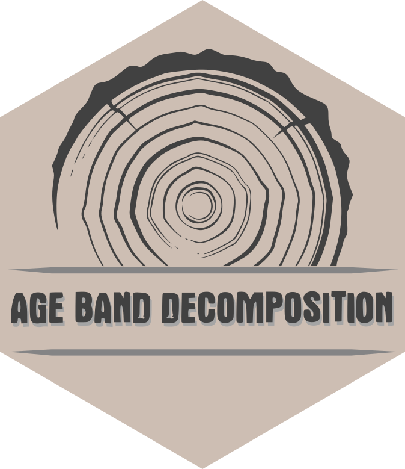
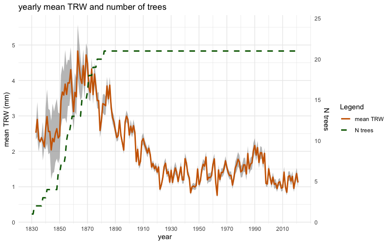
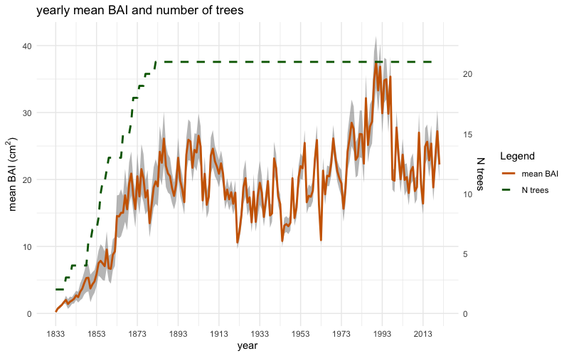
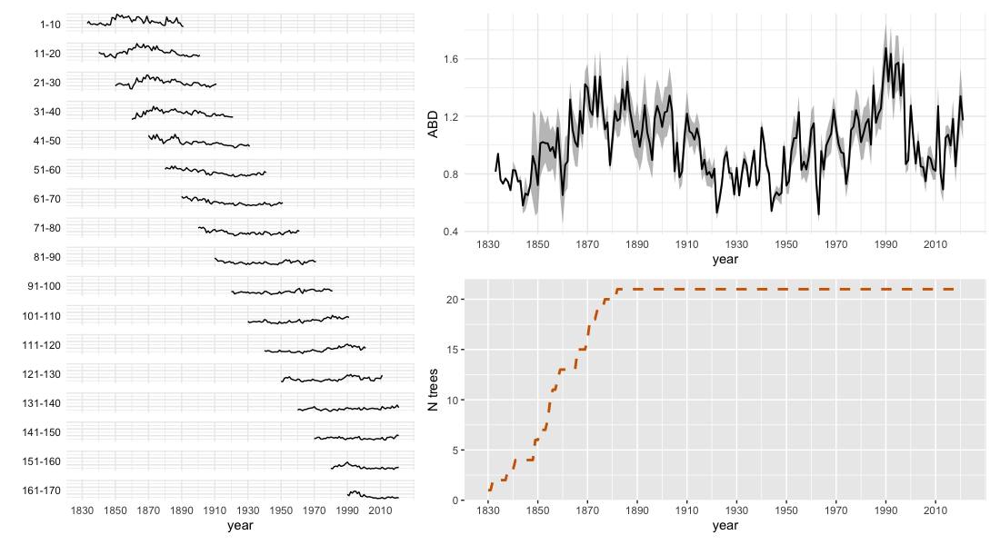

# AgeBandDecomposition

=======


<!--require(knitr);require(markdown);knit("README.Rmd")-->

**Authors:** [Nicola Puletti](https://orcid.org/0000-0002-2142-959X), 
[Gianluigi mazza](https://orcid.org/0000-0002-2744-2330)<br/>
**License:** [GPL3](https://cran.r-project.org/web/licenses/GPL-3)

`AgeBandDecomposition` provides tools for tree-ring standardization based on the Age Band Decomposition (ABD) method, for tree ring width standardization.

## Installation

Install the stable version from CRAN:

```r
install.packages("AgeBandDecomposition")
```

or the development version from this GitLab page:

```r
# install.packages("devtools")
remotes::install_git("https://gitlab.com/Puletti/agebanddecomposition_rpackage")
```

## Package Workflow


## Illustrative example

The package `AgeBandDecomposition` includes an example dataset of 21 tree-ring width series of silver fir (_Abies alba_ Mill.) spanning from 1830 to 2021 and located in the Italian Apennine core range (~ 1450 m a.s.l.), in the cool and moist oromediterranean belt with optimal growing conditions for the species.

This example starts with downloading the files named "TRW_example.rwl" and "pith.offset.txt", from the GitLab page of the package (see the folder "/main/studio/dati/"). For semplicity copy and paste these lines:

```r
# Download example files from the package's GitLab page
package_gitlab_site <- 'https://gitlab.com/Puletti/agebanddecomposition_rpackage'
rwl_url <- "/-/raw/main/studio/dati/TRW_example.rwl"
po_url <- "/-/raw/main/studio/dati/pith.offset.txt"

# Create temporary files
tmpfile_rwl <- tempfile(fileext = ".rwl")
tmpfile_po <- tempfile(fileext = ".txt")

# Download the files
download.file(paste0(package_gitlab_site, rwl_url),
              tmpfile_rwl,
              mode = "wb")

download.file(paste0(package_gitlab_site, po_url),
              tmpfile_po,
              mode = "wb")

# Import the data
inData <- import_rwl(rwl_path = tmpfile_rwl,
                             po_path = tmpfile_po,
                             ageBands = '1010',
                             first_age_class = NULL,
                             zero_as_na = TRUE,
                             verbose = TRUE)

# View the result
inData
```

The object `inData` can be initially used to plot the mean chronologies of raw tree-ring widths (mm) and raw basal area increments (cm²), including their standard errors, alongside the corresponding number of trees, using the two following functions: 

``` r
plotTRW(inData)
```



and

``` r
plotBAI(inData)
```


### Standardization (optional exploration)

Tree-ring width values can be standardized using the `stdTRW()` function, which removes the influences of local site characteristics by dividing each tree-ring width by the mean width of that series. This function is useful for exploratory analysis or custom workflows:

```r
# Optional: explore standardized TRW values
stdTRW_df <- stdTRW(inData[[1]])

# Calculate yearly averaged standardized TRW values
stdTRW_summary <- stdTRW_df |>
  dplyr::group_by(year) |>
  dplyr::summarise(
    N_trees = dplyr::n(),
    mean_stdTRW = mean(stdTRW, na.rm = TRUE)
  )
```

**Note:** The `ABD()` function (see below) performs standardization internally, so this step is not required for the ABD decomposition workflow.


### Age Band Decomposition Analysis

The core function `ABD()` performs the Age Band Decomposition analysis, which removes age-related growth trends to isolate climate signals.

```r
# ABD uses inData directly (standardization is done internally)
ABD_result <- ABD(inData, min_nTrees_year = 1)

# Export as .csv file
write.csv(ABD_result, file = 'your/path/file.csv')
```
The `plotABD()` function provides a comprehensive visualization of the results:

```r
# Perform ABD analysis and visualize results
plotABD(inData, min_nTrees_year = 1)
```

The resulting multi-panel plot displays:

- **Left panel**: Standardized tree-ring widths grouped by age bands (e.g., 1-10, 11-20, 21-30 years)

- **Top-right panel**: Final ABD chronology with standard error bands, representing growth corrected for age effects

- **Bottom-right panel**: Number of trees contributing to each year



**Key parameters:**

- `min_nTrees_year`: Minimum number of trees required per year within each age class (default: 3)

- `pct_stdTRW_th`: Minimum proportion of data required within an age band (default: 0.5 = 50%)

- `pct_Trees_th`: Threshold for calculating mean values (default: 0.3; increase to 0.5 for small samples <20 trees)
